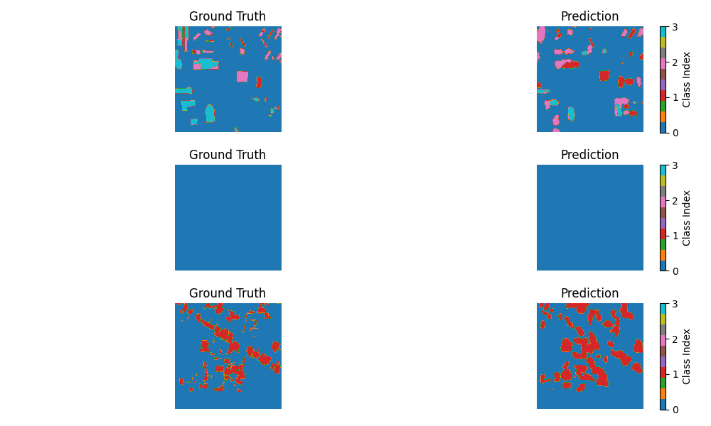

# Satellite Images for Disaster Recognition

This is the side project for 2025 Febuary. This project aims to assess building damage from satellite imagery using deep learning. It is based on the xView2 dataset, where the model predicts damage levels by comparing pre-disaster and post-disaster images. 

## Folder Organization
```bash
/2025-FRB
│── /data               # Ignored by .gitignore
│   │── /train
│   │   │── /images
│   │   │   │── /pre
│   │   │   │   │── *_pre_disaster.png
│   │   │   │── /post
│   │   │   │   │── *_post_disaster.png
│   │   │── /targets
│   │   │   │── /pre
│   │   │   │   │── *_pre_disaster_target.png
│   │   │   │── /post
│   │   │   │   │── *_post_disaster_target.png
|
│── /src                # Codes 
|── /best               # best result
│── .gitignore          # Prevents large files from being pushed
│── README.md           # Documentation
```

## Usage

Before started, you may want to download the dataset from [xView2](https://xview2.org/). Input the folders `image` and `targets` into `\data\train`, and rename them `raw_images` and `raw_targets`, repectively. Then run `src/organize_data.py`. 
> You will find the data has the structure as mentioned above, and you only have to run the code once.

### Training

Here are the hyperparameters you may want to adjust:
* Learning rate, batch size, optimizer and transformations. It's recommended to apply `visulization()` in `src/dataset,py` for checking the data alignment.

* The weight of loss, see `src/loss.py`. The default is using focal loss + dice loss to handle inbalancing.
* Learning rate scheduler, see `src/train.py`. The default is `ReduceLROnPlateau` monitoring the dice loss.
* UNet architecture, see `src/Unet.py`.

In addition, I've applied the tensorboard to understand the progress of training. Create a folder `run` and modify the `exp_id` in `src/main.py`.

Finally, run `src/main.py` to start training.

## Best Result

Check `best` for more details. The best model reaches dice score = 0.6 and MIoU = 0.48. 

However, there are still some improvement. I'd suggest that the weight of class 2 and 3 can be a bit higher.